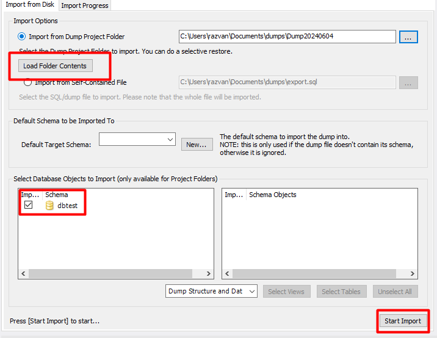
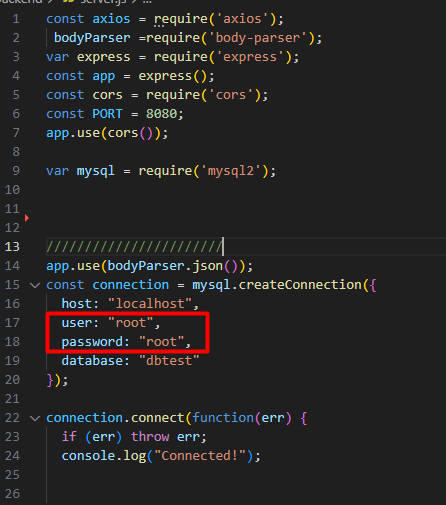
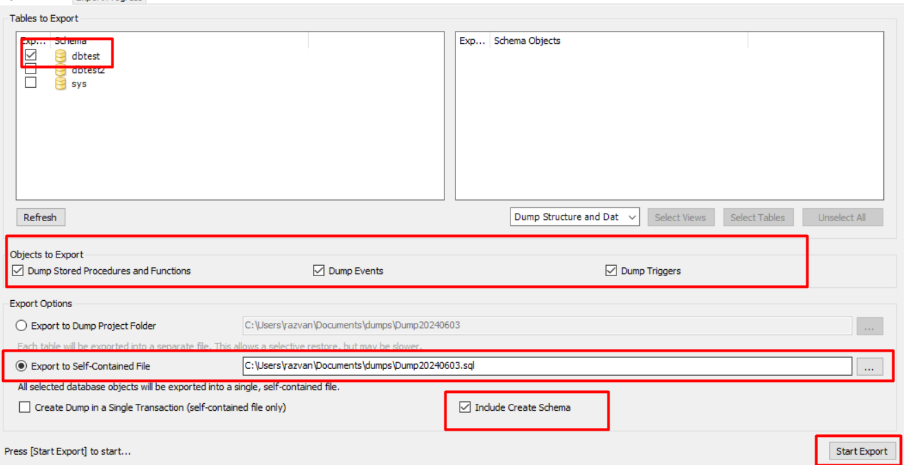

1-Copy paste the dump code in a SQL query or Select Server>Data Import

3-In order to login use the username and password for your localhost at the start of the server.js

3-To export the data base select Server>Data Export. Select the database and all the option in the photo above
